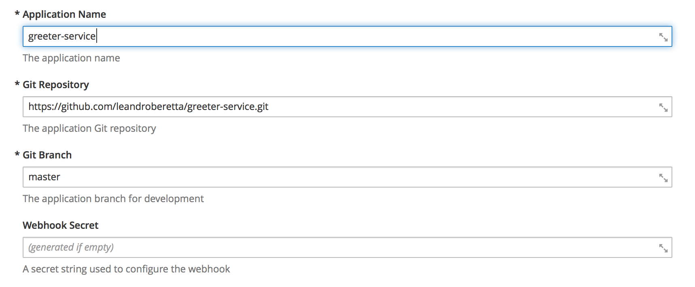
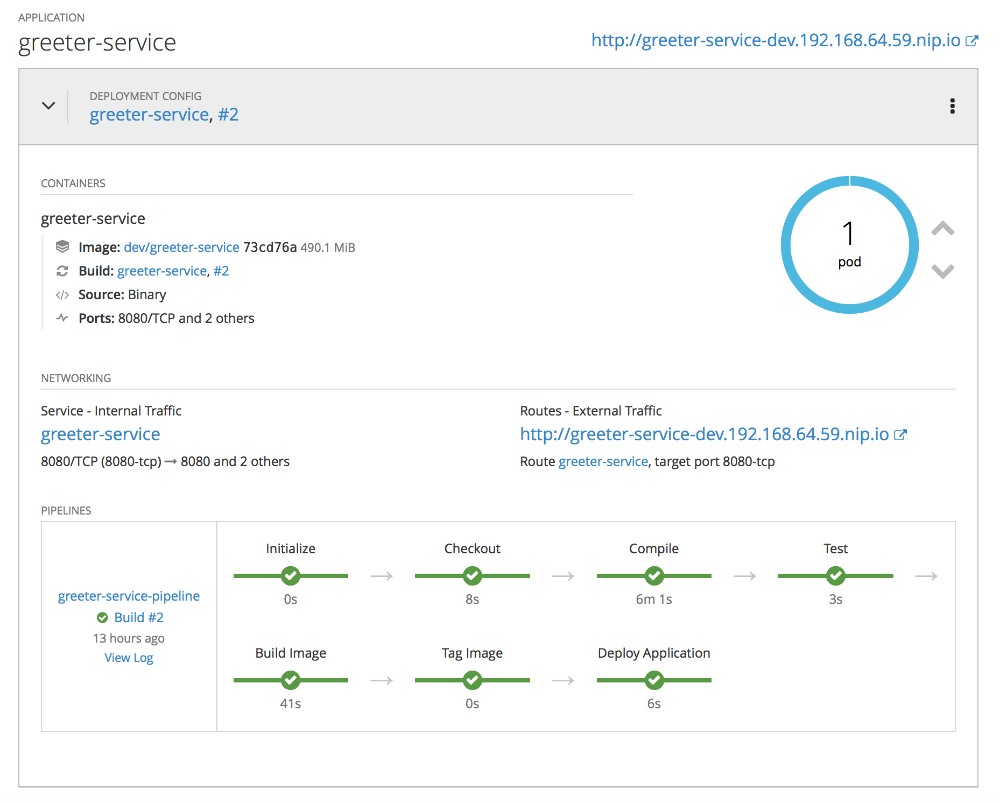

# openshift-java-app-template

The template creates a pipeline to deploy a Java application.

It uses an S2I image builder and the S2I binary strategy to upload the artifact generated in the pipeline.

The pipeline creates the resources for the application if they don't exist.

The main goal is to show that a template can create a pipeline which in turn creates the resources needed for the deployment.

## Usage

The template can be created in any project with the following commands:

    oc create -f java-app-template.yaml -n openshift

With the command above the template is created in the project **openshift**.

After its creation it's possible to create an application using the OpenShift catalog selecting the **Java Application** template.

A form is presented to be completed with information about the application like the Git repository, Git branch and the application name:

### Using the CLI

Using the **oc** CLI tool a demonstration can be made with the following commands:

    oc new-app --template=java-app-template -p PARAM_APP_NAME=greeter-service -p PARAM_GIT_REPO=https://github.com/leandroberetta/greeter-service

As a result a BuildConfig of type JenkinsPipeline is created:

    --> Deploying template "openshift/java-app-template" to project dev

     * With parameters:
        * Application Name=greeter-service
        * Git Repository=https://github.com/leandroberetta/greeter-service
        * Git Branch=master
        * Webhook Secret=qMCMmPiadIYl4dLoMOnGgQVoouPrE2mEg6qSOyh6 # generated

    --> Creating resources ...
        buildconfig "greeter-service-pipeline" created
    --> Success
        Use 'oc start-build greeter-service-pipeline' to start a build.
        Run 'oc status' to view your app.

Then a build can be started:

    oc start-build greeter-service-pipeline

The final result is the application deployed into an specific project:

